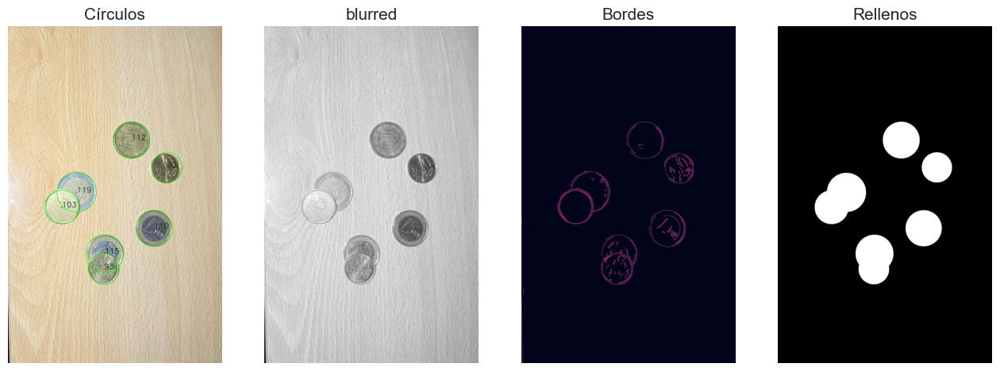

# P3-Deteccion-de-formas

###  Desarrollo

## Filtrado de objetos que no sean monedas

***El código carga una imagen que detecta los objetos en la imagen que no concuerdan con los contornos que puede tener una moneda***

- `img = cv2.imread('media/monedas_boligrafo.jpg')`. Carga la imagen de ejemplo con las monedas
- Luego, se pasa la imagen a escala de grises y se le aplica un umbralizado invertido.
- Ahora el código localiza los contornos en la imagen en la que hemos aplicado el umbralizado con la función *findColours* diseñada para imágenes con objetos blancos y el fondo negro.
 ```py
  contornos, hierarchy = cv2.findContours(
    img_th1, #imagen
    cv2.RETR_TREE, #Modo de recuperación (lista, árbol, nivel superior)
    cv2.CHAIN_APPROX_SIMPLE #Método de aproximación del contorno
    )
  ```
- Para distinguir los contornos de monedas con los de otros objetos, iteramos sobre los contornos enconntrados y como tenemos el radio de dichos contornos, el código calcula el área correspondiente que deberían tener si fueran circulares: `calculo_area = np.pi * np.square(radio)`
- Luego se compara ese área con el real que tiene el objeto y si supera el valor de un parámetro arbitrario se decidirá si se filtra o no para pintar sus contornos
  ```py
  if abs(area - calculo_area) < 100000:
    print("Area:", area, "Pi*r^2: ", calculo_area)    
    cv2.drawContours(img_cont, [c], -1, (255,255,255), -1)
  ```

  

  Figura 1: Imagen de las monedas tras ser filtradas

## Detección de monedas estando solapadas

***El código carga una imagen que detecta monedas a pesar de estar solapadas***

- `img = cv2.imread("media/monedones_solapados.jpg")`. Carga la imagen de ejemplo con las monedas.
- Luego, se pasa la imagen a escala de grises y se le aplica un umbralizado invertido y un operador Canny.
- Se realiza la busqueda de los círculos o bordes de las monedas haciendo uso de la función *HoughCircles*.
  ```py
  circles = cv2.HoughCircles(
    edges,
    cv2.HOUGH_GRADIENT,
    dp=1,  
    minDist=50, 
    param1=140,  
    param2=20,  
    minRadius=90,  
    maxRadius=120  
  ) 
  ```
- Teniendo en cuenta los radios de los circulos se asigna el tipo de monedas que son (1 euro, 50 cents., 20 cents., etc).

  

En esta tarea existe un error el cual no le encontramos solución, las monedas de 1 euro y de 50 céntimos tienen prácticamente el mismo tamaño
y cuando una de las dos se encuentra muy solapada por otra moneda es muy complicado diferenciarlas. Una solución que se nos ocurrió era diferenciar
las monedas por su tono de color, pero si la moneda esta muy solapada son prácticamente iguales en esta característica también, además de que los tonos
de color en las monedas pueden variar bastante dependiendo de la iluminación.

## Detección del valor de la moneda clickeada

***El código carga una imagen en la que se puede clickear una moneda y muestra el valor de ésta.***

- El proceso para detectar las monedas en la imagen es el mismo que en la anterior tarea.
- Se define una función *on_click* en el que se calcula la moneda que se encuentra a menor distancia del click dado, y así mostrar el valor de dicha moneda.
  ```py
  def on_click(event, x, y, flags, params):
    global selected_circle
    if event == cv2.EVENT_LBUTTONDOWN:
        # Calcula la distancia del clic de ratón a cada círculo y selecciona el más cercano
        min_distance = float('inf')
        for circle in circles[0]:
            center = (circle[0], circle[1])
            radius = circle[2]
            distance = np.sqrt((x - center[0]) ** 2 + (y - center[1]) ** 2)
            if distance < min_distance:
                min_distance = distance
                selected_circle = circle
        if selected_circle is not None:
            print("")
            cv2.destroyAllWindows()
  ```
 - Se le asigna a la ventana la función callback que se ha creado y se muestra dicha ventana.
 - Al clickear en una moneda en la ventana se hará un print de su valor.

En esta tarea existe el mismo error que en la anterior, las monedas de 1 euro y de 50 céntimos tienen prácticamente el mismo tamaño
y cuando una de las dos se encuentra muy solapada por otra moneda es muy complicado diferenciarlas.
