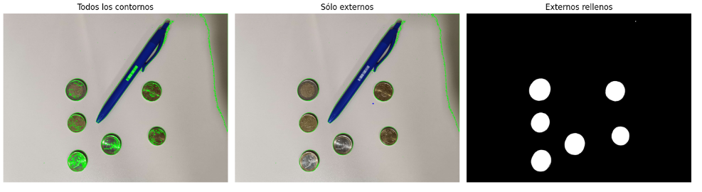

# P3-Deteccion-de-formas

###  Desarrollo

## Filtrado de objetos que no sean monedas

***El código carga una imagen que detecta los objetos en la imagen que no concuerdan con los contornos que puede tener una moneda***

- `img = cv2.imread('media/monedas_boligrafo.jpg')`. Carga la imagen de ejemplo con las monedas
- Luego, se pasa la imagen a escala de grises y se le aplica un umbralizado invertido.
- Ahora el código localiza los contornos en la imagen en la que hemos aplicado el umbralizado con la función *findColours* diseñada para imágenes con objetos blancos y el fondo negro.
 ```py
  contornos, hierarchy = cv2.findContours(
    img_th1, #imagen
    cv2.RETR_TREE, #Modo de recuperación (lista, árbol, nivel superior)
    cv2.CHAIN_APPROX_SIMPLE #Método de aproximación del contorno
    )
  ```
- Para distinguir los contornos de monedas con los de otros objetos, iteramos sobre los contornos enconntrados y como tenemos el radio de dichos contornos, el código calcula el área correspondiente que deberían tener si fueran circulares: `calculo_area = np.pi * np.square(radio)`
- Luego se compara ese área con el real que tiene el objeto y si supera el valor de un parámetro arbitrario se decidirá si se filtra o no para pintar sus contornos
  ```py
  if abs(area - calculo_area) < 100000:
    print("Area:", area, "Pi*r^2: ", calculo_area)    
    cv2.drawContours(img_cont, [c], -1, (255,255,255), -1)
  ```

  

  Figura 1: Imagen de las monedas tras ser filtradas

  

